# CoherentRaster: Efficient 3D Gaussian Splatting for Light Field Displays

> This file is the finalized Markdown-viewable raw extraction.
> Page renders and embedded images are preserved in the image folder.

Images: [pages](../image/coherentraster/pages)
Figures/Tables: [[coherentraster-figures-tables.md]]

### Page 1

<!-- page:1 chars:4168 image_objects:6 -->

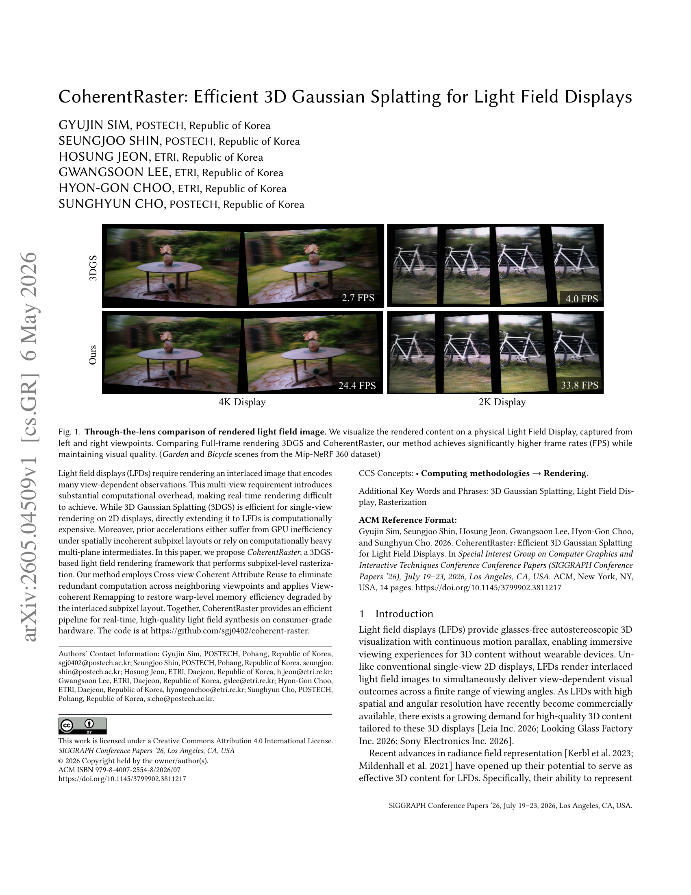

CoherentRaster: Efficient 3D Gaussian Splatting for Light Field Displays
GYUJIN SIM, POSTECH, Republic of Korea
SEUNGJOO SHIN, POSTECH, Republic of Korea
HOSUNG JEON, ETRI, Republic of Korea
GWANGSOON LEE, ETRI, Republic of Korea
HYON-GON CHOO, ETRI, Republic of Korea
SUNGHYUN CHO, POSTECH, Republic of Korea

##### 24.4 FPS

##### 2.7 FPS

4K Display 2K Display
Ours
3DGS

##### 4.0 FPS

##### 33.8 FPS

[[coherentraster-figures-tables.md#^fig-001|Fig. 1]]. Through-the-lens comparison of rendered light field image. We visualize the rendered content on a physical Light Field Display, captured from
left and right viewpoints. Comparing Full-frame rendering 3DGS and CoherentRaster, our method achieves significantly higher frame rates (FPS) while
maintaining visual quality. (Garden and Bicycle scenes from the Mip-NeRF 360 dataset)
Light field displays (LFDs) require rendering an interlaced image that encodes
many view-dependent observations. This multi-view requirement introduces
substantial computational overhead, making real-time rendering difficult
to achieve. While 3D Gaussian Splatting (3DGS) is efficient for single-view
rendering on 2D displays, directly extending it to LFDs is computationally
expensive. Moreover, prior accelerations either suffer from GPU inefficiency
under spatially incoherent subpixel layouts or rely on computationally heavy
multi-plane intermediates. In this paper, we propose CoherentRaster, a 3DGS-
based light field rendering framework that performs subpixel-level rasteriza-
tion. Our method employs Cross-view Coherent Attribute Reuse to eliminate
redundant computation across neighboring viewpoints and applies View-
coherent Remapping to restore warp-level memory efficiency degraded by
the interlaced subpixel layout. Together, CoherentRaster provides an efficient
pipeline for real-time, high-quality light field synthesis on consumer-grade
hardware. The code is at https://github.com/sgj0402/coherent-raster.
Authors’ Contact Information: Gyujin Sim, POSTECH, Pohang, Republic of Korea,
sgj0402@postech.ac.kr; Seungjoo Shin, POSTECH, Pohang, Republic of Korea, seungjoo.
shin@postech.ac.kr; Hosung Jeon, ETRI, Daejeon, Republic of Korea, h.jeon@etri.re.kr;
Gwangsoon Lee, ETRI, Daejeon, Republic of Korea, gslee@etri.re.kr; Hyon-Gon Choo,
ETRI, Daejeon, Republic of Korea, hyongonchoo@etri.re.kr; Sunghyun Cho, POSTECH,
Pohang, Republic of Korea, s.cho@postech.ac.kr.
This work is licensed under a Creative Commons Attribution 4.0 International License.
SIGGRAPH Conference Papers ’26, Los Angeles, CA, USA
© 2026 Copyright held by the owner/author(s).
ACM ISBN 979-8-4007-2554-8/2026/07
https://doi.org/10.1145/3799902.3811217
CCS Concepts: • Computing methodologies → Rendering.
Additional Key Words and Phrases: 3D Gaussian Splatting, Light Field Dis-
play, Rasterization
ACM Reference Format:
Gyujin Sim, Seungjoo Shin, Hosung Jeon, Gwangsoon Lee, Hyon-Gon Choo,
and Sunghyun Cho. 2026. CoherentRaster: Efficient 3D Gaussian Splatting
for Light Field Displays. In Special Interest Group on Computer Graphics and
Interactive Techniques Conference Conference Papers (SIGGRAPH Conference
Papers ’26), July 19-23, 2026, Los Angeles, CA, USA. ACM, New York, NY,
USA, 14 pages. https://doi.org/10.1145/3799902.3811217
^p001-abstract-01
^p003-methodology-01

#### 1 Introduction

Light field displays (LFDs) provide glasses-free autostereoscopic 3D
visualization with continuous motion parallax, enabling immersive
viewing experiences for 3D content without wearable devices. Un-
like conventional single-view 2D displays, LFDs render interlaced
light field images to simultaneously deliver view-dependent visual
outcomes across a finite range of viewing angles. As LFDs with high
spatial and angular resolution have recently become commercially
available, there exists a growing demand for high-quality 3D content
tailored to these 3D displays [Leia Inc. 2026; Looking Glass Factory
Inc. 2026; Sony Electronics Inc. 2026].
Recent advances in radiance field representation [Kerbl et al. 2023;
Mildenhall et al. 2021] have opened up their potential to serve as
effective 3D content for LFDs. Specifically, their ability to represent
SIGGRAPH Conference Papers ’26, July 19-23, 2026, Los Angeles, CA, USA.
arXiv:2605.04509v1
[cs.GR]
6
May
2026

### Page 2

<!-- page:2 chars:6885 image_objects:0 -->

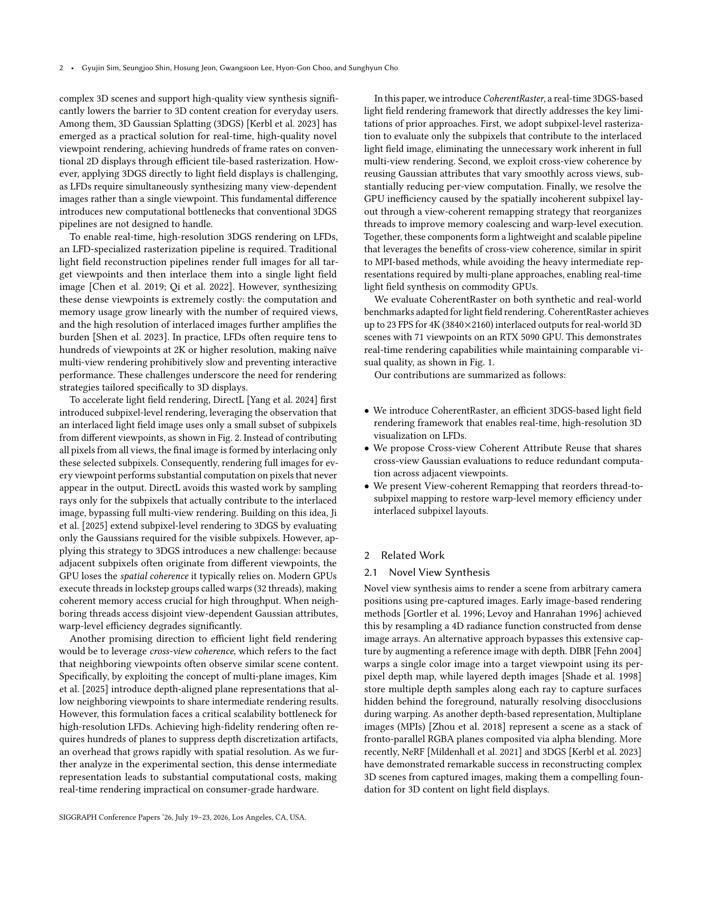

2 • Gyujin Sim, Seungjoo Shin, Hosung Jeon, Gwangsoon Lee, Hyon-Gon Choo, and Sunghyun Cho
complex 3D scenes and support high-quality view synthesis signifi-
cantly lowers the barrier to 3D content creation for everyday users.
Among them, 3D Gaussian Splatting (3DGS) [Kerbl et al. 2023] has
emerged as a practical solution for real-time, high-quality novel
viewpoint rendering, achieving hundreds of frame rates on conven-
tional 2D displays through efficient tile-based rasterization. How-
ever, applying 3DGS directly to light field displays is challenging,
as LFDs require simultaneously synthesizing many view-dependent
images rather than a single viewpoint. This fundamental difference
introduces new computational bottlenecks that conventional 3DGS
pipelines are not designed to handle.
To enable real-time, high-resolution 3DGS rendering on LFDs,
an LFD-specialized rasterization pipeline is required. Traditional
light field reconstruction pipelines render full images for all tar-
get viewpoints and then interlace them into a single light field
image [Chen et al. 2019; Qi et al. 2022]. However, synthesizing
these dense viewpoints is extremely costly: the computation and
memory usage grow linearly with the number of required views,
and the high resolution of interlaced images further amplifies the
burden [Shen et al. 2023]. In practice, LFDs often require tens to
hundreds of viewpoints at 2K or higher resolution, making naïve
multi-view rendering prohibitively slow and preventing interactive
performance. These challenges underscore the need for rendering
strategies tailored specifically to 3D displays.
To accelerate light field rendering, DirectL [Yang et al. 2024] first
introduced subpixel-level rendering, leveraging the observation that
an interlaced light field image uses only a small subset of subpixels
from different viewpoints, as shown in [[coherentraster-figures-tables.md#^fig-002|Fig. 2]]. Instead of contributing
all pixels from all views, the final image is formed by interlacing only
these selected subpixels. Consequently, rendering full images for ev-
ery viewpoint performs substantial computation on pixels that never
appear in the output. DirectL avoids this wasted work by sampling
rays only for the subpixels that actually contribute to the interlaced
image, bypassing full multi-view rendering. Building on this idea, Ji
et al. [2025] extend subpixel-level rendering to 3DGS by evaluating
only the Gaussians required for the visible subpixels. However, ap-
plying this strategy to 3DGS introduces a new challenge: because
adjacent subpixels often originate from different viewpoints, the
GPU loses the spatial coherence it typically relies on. Modern GPUs
execute threads in lockstep groups called warps (32 threads), making
coherent memory access crucial for high throughput. When neigh-
boring threads access disjoint view-dependent Gaussian attributes,
warp-level efficiency degrades significantly.
Another promising direction to efficient light field rendering
would be to leverage cross-view coherence, which refers to the fact
that neighboring viewpoints often observe similar scene content.
Specifically, by exploiting the concept of multi-plane images, Kim
et al. [2025] introduce depth-aligned plane representations that al-
low neighboring viewpoints to share intermediate rendering results.
However, this formulation faces a critical scalability bottleneck for
high-resolution LFDs. Achieving high-fidelity rendering often re-
quires hundreds of planes to suppress depth discretization artifacts,
an overhead that grows rapidly with spatial resolution. As we fur-
ther analyze in the experimental section, this dense intermediate
representation leads to substantial computational costs, making
real-time rendering impractical on consumer-grade hardware.
In this paper, we introduce CoherentRaster, a real-time 3DGS-based
light field rendering framework that directly addresses the key limi-
tations of prior approaches. First, we adopt subpixel-level rasteriza-
tion to evaluate only the subpixels that contribute to the interlaced
light field image, eliminating the unnecessary work inherent in full
multi-view rendering. Second, we exploit cross-view coherence by
reusing Gaussian attributes that vary smoothly across views, sub-
stantially reducing per-view computation. Finally, we resolve the
GPU inefficiency caused by the spatially incoherent subpixel lay-
out through a view-coherent remapping strategy that reorganizes
threads to improve memory coalescing and warp-level execution.
Together, these components form a lightweight and scalable pipeline
that leverages the benefits of cross-view coherence, similar in spirit
to MPI-based methods, while avoiding the heavy intermediate rep-
resentations required by multi-plane approaches, enabling real-time
light field synthesis on commodity GPUs.
We evaluate CoherentRaster on both synthetic and real-world
benchmarks adapted for light field rendering. CoherentRaster achieves
up to 23 FPS for 4K (3840×2160) interlaced outputs for real-world 3D
scenes with 71 viewpoints on an RTX 5090 GPU. This demonstrates
real-time rendering capabilities while maintaining comparable vi-
sual quality, as shown in [[coherentraster-figures-tables.md#^fig-001|Fig. 1]].
Our contributions are summarized as follows:
• We introduce CoherentRaster, an efficient 3DGS-based light field
rendering framework that enables real-time, high-resolution 3D
visualization on LFDs.
• We propose Cross-view Coherent Attribute Reuse that shares
cross-view Gaussian evaluations to reduce redundant computa-
tion across adjacent viewpoints.
• We present View-coherent Remapping that reorders thread-to-
subpixel mapping to restore warp-level memory efficiency under
interlaced subpixel layouts.
^p004-results-01

#### 2 Related Work
^p002-related-work-01

##### 2.1 Novel View Synthesis

Novel view synthesis aims to render a scene from arbitrary camera
positions using pre-captured images. Early image-based rendering
methods [Gortler et al. 1996; Levoy and Hanrahan 1996] achieved
this by resampling a 4D radiance function constructed from dense
image arrays. An alternative approach bypasses this extensive cap-
ture by augmenting a reference image with depth. DIBR [Fehn 2004]
warps a single color image into a target viewpoint using its per-
pixel depth map, while layered depth images [Shade et al. 1998]
store multiple depth samples along each ray to capture surfaces
hidden behind the foreground, naturally resolving disocclusions
during warping. As another depth-based representation, Multiplane
images (MPIs) [Zhou et al. 2018] represent a scene as a stack of
fronto-parallel RGBA planes composited via alpha blending. More
recently, NeRF [Mildenhall et al. 2021] and 3DGS [Kerbl et al. 2023]
have demonstrated remarkable success in reconstructing complex
3D scenes from captured images, making them a compelling foun-
dation for 3D content on light field displays.
SIGGRAPH Conference Papers ’26, July 19-23, 2026, Los Angeles, CA, USA.

### Page 3

<!-- page:3 chars:5918 image_objects:6 -->

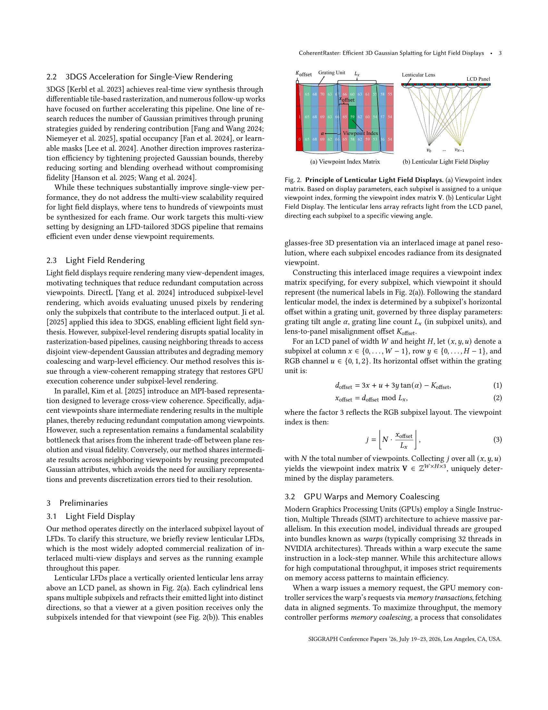

CoherentRaster: Efficient 3D Gaussian Splatting for Light Field Displays • 3
2.2 3DGS Acceleration for Single-View Rendering
3DGS [Kerbl et al. 2023] achieves real-time view synthesis through
differentiable tile-based rasterization, and numerous follow-up works
have focused on further accelerating this pipeline. One line of re-
search reduces the number of Gaussian primitives through pruning
strategies guided by rendering contribution [Fang and Wang 2024;
Niemeyer et al. 2025], spatial occupancy [Fan et al. 2024], or learn-
able masks [Lee et al. 2024]. Another direction improves rasteriza-
tion efficiency by tightening projected Gaussian bounds, thereby
reducing sorting and blending overhead without compromising
fidelity [Hanson et al. 2025; Wang et al. 2024].
While these techniques substantially improve single-view per-
formance, they do not address the multi-view scalability required
for light field displays, where tens to hundreds of viewpoints must
be synthesized for each frame. Our work targets this multi-view
setting by designing an LFD-tailored 3DGS pipeline that remains
efficient even under dense viewpoint requirements.

##### 2.3 Light Field Rendering

Light field displays require rendering many view-dependent images,
motivating techniques that reduce redundant computation across
viewpoints. DirectL [Yang et al. 2024] introduced subpixel-level
rendering, which avoids evaluating unused pixels by rendering
only the subpixels that contribute to the interlaced output. Ji et al.
[2025] applied this idea to 3DGS, enabling efficient light field syn-
thesis. However, subpixel-level rendering disrupts spatial locality in
rasterization-based pipelines, causing neighboring threads to access
disjoint view-dependent Gaussian attributes and degrading memory
coalescing and warp-level efficiency. Our method resolves this is-
sue through a view-coherent remapping strategy that restores GPU
execution coherence under subpixel-level rendering.
In parallel, Kim et al. [2025] introduce an MPI-based representa-
tion designed to leverage cross-view coherence. Specifically, adja-
cent viewpoints share intermediate rendering results in the multiple
planes, thereby reducing redundant computation among viewpoints.
However, such a representation remains a fundamental scalability
bottleneck that arises from the inherent trade-off between plane res-
olution and visual fidelity. Conversely, our method shares intermedi-
ate results across neighboring viewpoints by reusing precomputed
Gaussian attributes, which avoids the need for auxiliary representa-
tions and prevents discretization errors tied to their resolution.

#### 3 Preliminaries

##### 3.1 Light Field Display

Our method operates directly on the interlaced subpixel layout of
LFDs. To clarify this structure, we briefly review lenticular LFDs,
which is the most widely adopted commercial realization of in-
terlaced multi-view displays and serves as the running example
throughout this paper.
Lenticular LFDs place a vertically oriented lenticular lens array
above an LCD panel, as shown in [[coherentraster-figures-tables.md#^fig-002|Fig. 2]](a). Each cylindrical lens
spans multiple subpixels and refracts their emitted light into distinct
directions, so that a viewer at a given position receives only the
subpixels intended for that viewpoint (see [[coherentraster-figures-tables.md#^fig-002|Fig. 2]](b)). This enables
(b) Lenticular Light Field Display
LCD Panel
଴ ேିଵ
Lenticular Lens
(a) Viewpoint Index Matrix
1 65 68 70 63 67 66 60 63 61 55 58 55
1 65 68 69 63 66 65 62 60 54 57 54
0 65 68 69 62 66 65 58 62 59 53 56 54
Grating Unit ௫
Viewpoint Index
59
59
59
[[coherentraster-figures-tables.md#^fig-002|Fig. 2]]. Principle of Lenticular Light Field Displays. (a) Viewpoint index
matrix. Based on display parameters, each subpixel is assigned to a unique
viewpoint index, forming the viewpoint index matrix V. (b) Lenticular Light
Field Display. The lenticular lens array refracts light from the LCD panel,
directing each subpixel to a specific viewing angle.
glasses-free 3D presentation via an interlaced image at panel reso-
lution, where each subpixel encodes radiance from its designated
viewpoint.
Constructing this interlaced image requires a viewpoint index
matrix specifying, for every subpixel, which viewpoint it should
represent (the numerical labels in [[coherentraster-figures-tables.md#^fig-002|Fig. 2]](a)). Following the standard
lenticular model, the index is determined by a subpixel’s horizontal
offset within a grating unit, governed by three display parameters:
grating tilt angle 𝛼, grating line count 𝐿𝑥 (in subpixel units), and
lens-to-panel misalignment offset 𝐾offset.
For an LCD panel of width 𝑊 and height 𝐻, let (𝑥,𝑦,𝑢) denote a
subpixel at column 𝑥 ∈ {0, . . . ,𝑊 − 1}, row 𝑦 ∈ {0, . . . , 𝐻 − 1}, and
RGB channel 𝑢 ∈ {0, 1, 2}. Its horizontal offset within the grating
unit is:
𝑑offset = 3𝑥 + 𝑢 + 3𝑦 tan(𝛼) − 𝐾offset, (1)
𝑥offset = 𝑑offset mod 𝐿𝑥, (2)
where the factor 3 reflects the RGB subpixel layout. The viewpoint
index is then:
𝑗 =

𝑁 ·
𝑥offset
𝐿𝑥

, (3)
with 𝑁 the total number of viewpoints. Collecting 𝑗 over all (𝑥,𝑦,𝑢)
yields the viewpoint index matrix V ∈ Z𝑊 ×𝐻 ×3, uniquely deter-
mined by the display parameters.

##### 3.2 GPU Warps and Memory Coalescing

Modern Graphics Processing Units (GPUs) employ a Single Instruc-
tion, Multiple Threads (SIMT) architecture to achieve massive par-
allelism. In this execution model, individual threads are grouped
into bundles known as warps (typically comprising 32 threads in
NVIDIA architectures). Threads within a warp execute the same
instruction in a lock-step manner. While this architecture allows
for high computational throughput, it imposes strict requirements
on memory access patterns to maintain efficiency.
When a warp issues a memory request, the GPU memory con-
troller services the warp’s requests via memory transactions, fetching
data in aligned segments. To maximize throughput, the memory
controller performs memory coalescing, a process that consolidates
SIGGRAPH Conference Papers ’26, July 19-23, 2026, Los Angeles, CA, USA.

### Page 4

<!-- page:4 chars:6633 image_objects:0 -->

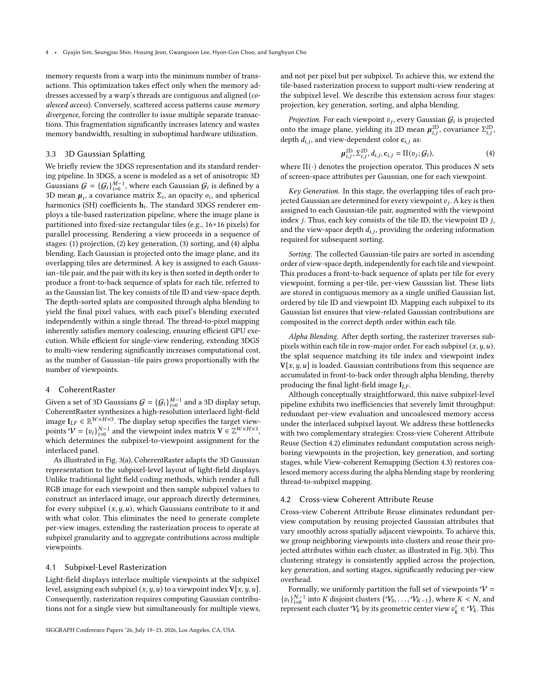

4 • Gyujin Sim, Seungjoo Shin, Hosung Jeon, Gwangsoon Lee, Hyon-Gon Choo, and Sunghyun Cho
memory requests from a warp into the minimum number of trans-
actions. This optimization takes effect only when the memory ad-
dresses accessed by a warp’s threads are contiguous and aligned (co-
alesced access). Conversely, scattered access patterns cause memory
divergence, forcing the controller to issue multiple separate transac-
tions. This fragmentation significantly increases latency and wastes
memory bandwidth, resulting in suboptimal hardware utilization.
3.3 3D Gaussian Splatting
We briefly review the 3DGS representation and its standard render-
ing pipeline. In 3DGS, a scene is modeled as a set of anisotropic 3D
Gaussians G = {G𝑖 }𝑀−1
𝑖=0 , where each Gaussian G𝑖 is defined by a
3D mean 𝝁𝑖, a covariance matrix 𝚺𝑖, an opacity 𝑜𝑖, and spherical
harmonics (SH) coefficients h𝑖. The standard 3DGS renderer em-
ploys a tile-based rasterization pipeline, where the image plane is
partitioned into fixed-size rectangular tiles (e.g., 16×16 pixels) for
parallel processing. Rendering a view proceeds in a sequence of
stages: (1) projection, (2) key generation, (3) sorting, and (4) alpha
blending. Each Gaussian is projected onto the image plane, and its
overlapping tiles are determined. A key is assigned to each Gauss-
ian-tile pair, and the pair with its key is then sorted in depth order to
produce a front-to-back sequence of splats for each tile, referred to
as the Gaussian list. The key consists of tile ID and view-space depth.
The depth-sorted splats are composited through alpha blending to
yield the final pixel values, with each pixel’s blending executed
independently within a single thread. The thread-to-pixel mapping
inherently satisfies memory coalescing, ensuring efficient GPU exe-
cution. While efficient for single-view rendering, extending 3DGS
to multi-view rendering significantly increases computational cost,
as the number of Gaussian-tile pairs grows proportionally with the
number of viewpoints.

#### 4 CoherentRaster

Given a set of 3D Gaussians G = {G𝑖 }𝑀−1
𝑖=0 and a 3D display setup,
CoherentRaster synthesizes a high-resolution interlaced light-field
image I𝐿𝐹 ∈ R𝑊 ×𝐻 ×3. The display setup specifies the target view-
points V = {𝑣𝑖 }𝑁 −1
𝑖=0 and the viewpoint index matrix V ∈ Z𝑊 ×𝐻 ×3,
which determines the subpixel-to-viewpoint assignment for the
interlaced panel.
As illustrated in [[coherentraster-figures-tables.md#^fig-003|Fig. 3]](a), CoherentRaster adapts the 3D Gaussian
representation to the subpixel-level layout of light-field displays.
Unlike traditional light field coding methods, which render a full
RGB image for each viewpoint and then sample subpixel values to
construct an interlaced image, our approach directly determines,
for every subpixel (𝑥,𝑦,𝑢), which Gaussians contribute to it and
with what color. This eliminates the need to generate complete
per-view images, extending the rasterization process to operate at
subpixel granularity and to aggregate contributions across multiple
viewpoints.

##### 4.1 Subpixel-Level Rasterization

Light-field displays interlace multiple viewpoints at the subpixel
level, assigning each subpixel (𝑥,𝑦,𝑢) to a viewpoint index V[𝑥,𝑦,𝑢].
Consequently, rasterization requires computing Gaussian contribu-
tions not for a single view but simultaneously for multiple views,
and not per pixel but per subpixel. To achieve this, we extend the
tile-based rasterization process to support multi-view rendering at
the subpixel level. We describe this extension across four stages:
projection, key generation, sorting, and alpha blending.
Projection. For each viewpoint 𝑣𝑗 , every Gaussian G𝑖 is projected
onto the image plane, yielding its 2D mean 𝝁2D
𝑖,𝑗 , covariance Σ2D
𝑖,𝑗 ,
depth 𝑑𝑖,𝑗 , and view-dependent color c𝑖,𝑗 as:
𝝁2D
𝑖,𝑗 , Σ2D
𝑖,𝑗 ,𝑑𝑖,𝑗, c𝑖,𝑗 = Π(𝑣𝑗 ; G𝑖), (4)
where Π(·) denotes the projection operator. This produces 𝑁 sets
of screen-space attributes per Gaussian, one for each viewpoint.
Key Generation. In this stage, the overlapping tiles of each pro-
jected Gaussian are determined for every viewpoint 𝑣𝑗 . A key is then
assigned to each Gaussian-tile pair, augmented with the viewpoint
index 𝑗. Thus, each key consists of the tile ID, the viewpoint ID 𝑗,
and the view-space depth 𝑑𝑖,𝑗 , providing the ordering information
required for subsequent sorting.
Sorting. The collected Gaussian-tile pairs are sorted in ascending
order of view-space depth, independently for each tile and viewpoint.
This produces a front-to-back sequence of splats per tile for every
viewpoint, forming a per-tile, per-view Gaussian list. These lists
are stored in contiguous memory as a single unified Gaussian list,
ordered by tile ID and viewpoint ID. Mapping each subpixel to its
Gaussian list ensures that view-related Gaussian contributions are
composited in the correct depth order within each tile.
Alpha Blending. After depth sorting, the rasterizer traverses sub-
pixels within each tile in row-major order. For each subpixel (𝑥,𝑦,𝑢),
the splat sequence matching its tile index and viewpoint index
V[𝑥,𝑦,𝑢] is loaded. Gaussian contributions from this sequence are
accumulated in front-to-back order through alpha blending, thereby
producing the final light-field image I𝐿𝐹 .
Although conceptually straightforward, this naive subpixel-level
pipeline exhibits two inefficiencies that severely limit throughput:
redundant per-view evaluation and uncoalesced memory access
under the interlaced subpixel layout. We address these bottlenecks
with two complementary strategies: Cross-view Coherent Attribute
Reuse (Section 4.2) eliminates redundant computation across neigh-
boring viewpoints in the projection, key generation, and sorting
stages, while View-coherent Remapping (Section 4.3) restores coa-
lesced memory access during the alpha blending stage by reordering
thread-to-subpixel mapping.

##### 4.2 Cross-view Coherent Attribute Reuse

Cross-view Coherent Attribute Reuse eliminates redundant per-
view computation by reusing projected Gaussian attributes that
vary smoothly across spatially adjacent viewpoints. To achieve this,
we group neighboring viewpoints into clusters and reuse their pro-
jected attributes within each cluster, as illustrated in [[coherentraster-figures-tables.md#^fig-003|Fig. 3]](b). This
clustering strategy is consistently applied across the projection,
key generation, and sorting stages, significantly reducing per-view
overhead.
Formally, we uniformly partition the full set of viewpoints V =
{𝑣𝑖 }𝑁 −1
𝑖=0 into 𝐾 disjoint clusters {V0, . . . , V𝐾−1}, where 𝐾 < 𝑁, and
represent each cluster V𝑘 by its geometric center view 𝑣′
𝑘
∈ V𝑘 . This
SIGGRAPH Conference Papers ’26, July 19-23, 2026, Los Angeles, CA, USA.

### Page 5

<!-- page:5 chars:4070 image_objects:3 -->

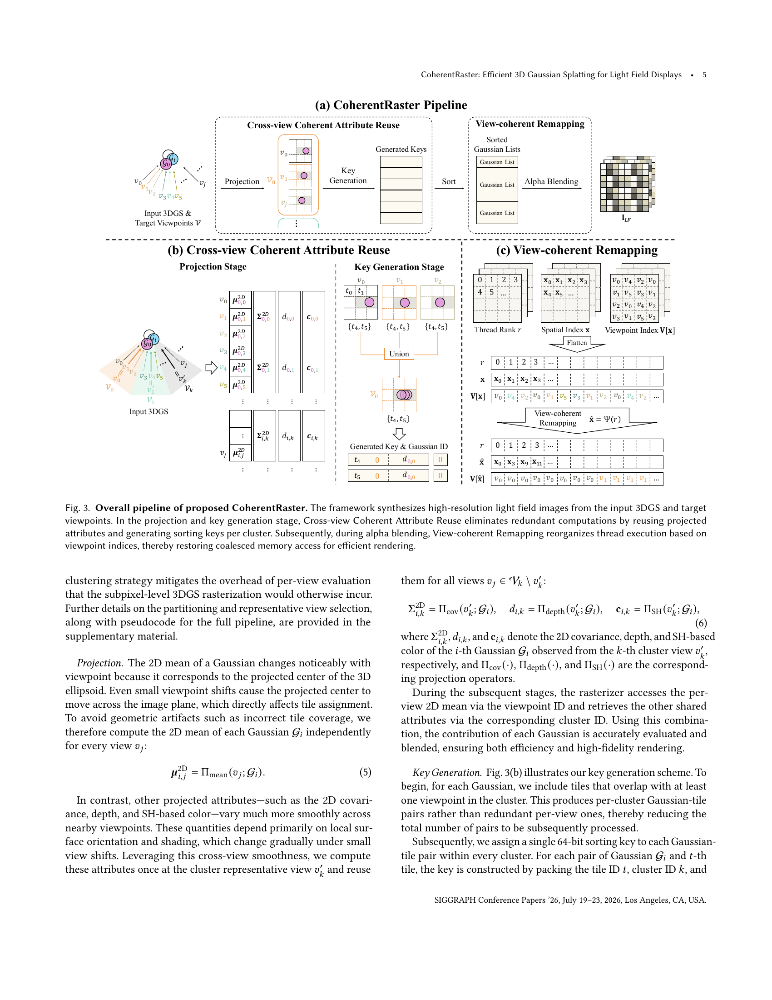

CoherentRaster: Efficient 3D Gaussian Splatting for Light Field Displays • 5
(b) Cross-view Coherent Attribute Reuse (c) View-coherent Remapping
 3
0 1 2 …
[
] 
    
      …

   …



   …

[] 
    
      …
 3
0 1 2 …
View-coherent
Remapping 
 = Ψ 
Flatten
Projection Stage

  

 





=






Input 3DGS
,

,

,

,

,

,

,

,

,







,
,
,
,
,
,
…
…
…
…
,


…
…
…
…
…
 0 ,
 0 ,
Generated Key & Gaussian ID
0
0
Union

{,}

 
{,}

{,}

{,}
Key Generation Stage
Viewpoint Index []





















…

Spatial Index 
0
4
1
5
2
…
3
Thread Rank 
(a) CoherentRaster Pipeline

  





Input 3DGS &
Target Viewpoints 
Cross-view Coherent Attribute Reuse

View-coherent Remapping
Gaussian List
Gaussian List
Gaussian List
Sorted
Gaussian Lists
Generated Keys




…
Projection
Key
Generation Sort Alpha Blending
[[coherentraster-figures-tables.md#^fig-003|Fig. 3]]. Overall pipeline of proposed CoherentRaster. The framework synthesizes high-resolution light field images from the input 3DGS and target
viewpoints. In the projection and key generation stage, Cross-view Coherent Attribute Reuse eliminates redundant computations by reusing projected
attributes and generating sorting keys per cluster. Subsequently, during alpha blending, View-coherent Remapping reorganizes thread execution based on
viewpoint indices, thereby restoring coalesced memory access for efficient rendering.
clustering strategy mitigates the overhead of per-view evaluation
that the subpixel-level 3DGS rasterization would otherwise incur.
Further details on the partitioning and representative view selection,
along with pseudocode for the full pipeline, are provided in the
supplementary material.
Projection. The 2D mean of a Gaussian changes noticeably with
viewpoint because it corresponds to the projected center of the 3D
ellipsoid. Even small viewpoint shifts cause the projected center to
move across the image plane, which directly affects tile assignment.
To avoid geometric artifacts such as incorrect tile coverage, we
therefore compute the 2D mean of each Gaussian G𝑖 independently
for every view 𝑣𝑗 :
𝝁2D
𝑖,𝑗 = Πmean(𝑣𝑗 ; G𝑖). (5)
In contrast, other projected attributes-such as the 2D covari-
ance, depth, and SH-based color-vary much more smoothly across
nearby viewpoints. These quantities depend primarily on local sur-
face orientation and shading, which change gradually under small
view shifts. Leveraging this cross-view smoothness, we compute
these attributes once at the cluster representative view 𝑣′
𝑘
and reuse
them for all views 𝑣𝑗 ∈ V𝑘 \ 𝑣′
𝑘
:
𝚺2D
𝑖,𝑘 = Πcov(𝑣′
𝑘 ; G𝑖), 𝑑𝑖,𝑘 = Πdepth(𝑣′
𝑘 ; G𝑖), c𝑖,𝑘 = ΠSH(𝑣′
𝑘 ; G𝑖),
(6)
where 𝚺2D
𝑖,𝑘 ,𝑑𝑖,𝑘 , and c𝑖,𝑘 denote the 2D covariance, depth, and SH-based
color of the 𝑖-th Gaussian G𝑖 observed from the 𝑘-th cluster view 𝑣′
𝑘
,
respectively, and Πcov(·), Πdepth(·), and ΠSH(·) are the correspond-
ing projection operators.
During the subsequent stages, the rasterizer accesses the per-
view 2D mean via the viewpoint ID and retrieves the other shared
attributes via the corresponding cluster ID. Using this combina-
tion, the contribution of each Gaussian is accurately evaluated and
blended, ensuring both efficiency and high-fidelity rendering.
Key Generation. [[coherentraster-figures-tables.md#^fig-003|Fig. 3]](b) illustrates our key generation scheme. To
begin, for each Gaussian, we include tiles that overlap with at least
one viewpoint in the cluster. This produces per-cluster Gaussian-tile
pairs rather than redundant per-view ones, thereby reducing the
total number of pairs to be subsequently processed.
Subsequently, we assign a single 64-bit sorting key to each Gaussian-
tile pair within every cluster. For each pair of Gaussian G𝑖 and 𝑡-th
tile, the key is constructed by packing the tile ID 𝑡, cluster ID 𝑘, and
SIGGRAPH Conference Papers ’26, July 19-23, 2026, Los Angeles, CA, USA.

### Page 6

<!-- page:6 chars:6390 image_objects:0 -->

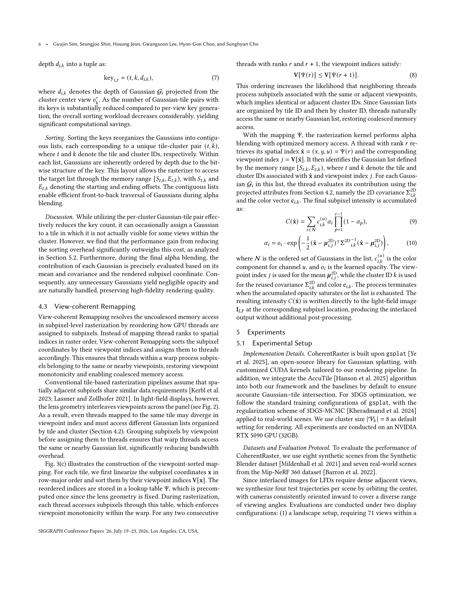

6 • Gyujin Sim, Seungjoo Shin, Hosung Jeon, Gwangsoon Lee, Hyon-Gon Choo, and Sunghyun Cho
depth 𝑑𝑖,𝑘 into a tuple as:
key𝑖,𝑡 = (𝑡,𝑘,𝑑𝑖,𝑘 ), (7)
where 𝑑𝑖,𝑘 denotes the depth of Gaussian G𝑖 projected from the
cluster center view 𝑣′
𝑘
. As the number of Gaussian-tile pairs with
its keys is substantially reduced compared to per-view key genera-
tion, the overall sorting workload decreases considerably, yielding
significant computational savings.
Sorting. Sorting the keys reorganizes the Gaussians into contigu-
ous lists, each corresponding to a unique tile-cluster pair (𝑡,𝑘),
where 𝑡 and 𝑘 denote the tile and cluster IDs, respectively. Within
each list, Gaussians are inherently ordered by depth due to the bit-
wise structure of the key. This layout allows the rasterizer to access
the target list through the memory range [𝑆𝑡,𝑘, 𝐸𝑡,𝑘 ), with 𝑆𝑡,𝑘 and
𝐸𝑡,𝑘 denoting the starting and ending offsets. The contiguous lists
enable efficient front-to-back traversal of Gaussians during alpha
blending.
Discussion. While utilizing the per-cluster Gaussian-tile pair effec-
tively reduces the key count, it can occasionally assign a Gaussian
to a tile in which it is not actually visible for some views within the
cluster. However, we find that the performance gain from reducing
the sorting overhead significantly outweighs this cost, as analyzed
in Section 5.2. Furthermore, during the final alpha blending, the
contribution of each Gaussian is precisely evaluated based on its
mean and covariance and the rendered subpixel coordinate. Con-
sequently, any unnecessary Gaussians yield negligible opacity and
are naturally handled, preserving high-fidelity rendering quality.
^p005-conclusion-01

##### 4.3 View-coherent Remapping

View-coherent Remapping resolves the uncoalesced memory access
in subpixel-level rasterization by reordering how GPU threads are
assigned to subpixels. Instead of mapping thread ranks to spatial
indices in raster order, View-coherent Remapping sorts the subpixel
coordinates by their viewpoint indices and assigns them to threads
accordingly. This ensures that threads within a warp process subpix-
els belonging to the same or nearby viewpoints, restoring viewpoint
monotonicity and enabling coalesced memory access.
Conventional tile-based rasterization pipelines assume that spa-
tially adjacent subpixels share similar data requirements [Kerbl et al.
2023; Lassner and Zollhofer 2021]. In light-field displays, however,
the lens geometry interleaves viewpoints across the panel (see [[coherentraster-figures-tables.md#^fig-002|Fig. 2]]).
As a result, even threads mapped to the same tile may diverge in
viewpoint index and must access different Gaussian lists organized
by tile and cluster (Section 4.2). Grouping subpixels by viewpoint
before assigning them to threads ensures that warp threads access
the same or nearby Gaussian list, significantly reducing bandwidth
overhead.
[[coherentraster-figures-tables.md#^fig-003|Fig. 3]](c) illustrates the construction of the viewpoint-sorted map-
ping. For each tile, we first linearize the subpixel coordinates x in
row-major order and sort them by their viewpoint indices V[x]. The
reordered indices are stored in a lookup table Ψ, which is precom-
puted once since the lens geometry is fixed. During rasterization,
each thread accesses subpixels through this table, which enforces
viewpoint monotonicity within the warp. For any two consecutive
threads with ranks 𝑟 and 𝑟 + 1, the viewpoint indices satisfy:
V[Ψ(𝑟)] ≤ V[Ψ(𝑟 + 1)]. (8)
This ordering increases the likelihood that neighboring threads
process subpixels associated with the same or adjacent viewpoints,
which implies identical or adjacent cluster IDs. Since Gaussian lists
are organized by tile ID and then by cluster ID, threads naturally
access the same or nearby Gaussian list, restoring coalesced memory
access.
With the mapping Ψ, the rasterization kernel performs alpha
blending with optimized memory access. A thread with rank 𝑟 re-
trieves its spatial index x̂ = (𝑥,𝑦,𝑢) = Ψ(𝑟) and the corresponding
viewpoint index 𝑗 = V[x̂]. It then identifies the Gaussian list defined
by the memory range [𝑆𝑡,𝑘, 𝐸𝑡,𝑘 ), where 𝑡 and 𝑘 denote the tile and
cluster IDs associated with x̂ and viewpoint index 𝑗. For each Gauss-
ian G𝑖 in this list, the thread evaluates its contribution using the
projected attributes from Section 4.2, namely the 2D covariance 𝚺2D
𝑖,𝑘
and the color vector c𝑖,𝑘 . The final subpixel intensity is accumulated
as:
𝐶(x̂) =
∑︁
𝑖∈N
𝑐(𝑢)
𝑖,𝑘
𝛼𝑖
𝑖−1
Ö
𝑝=1
(1 − 𝛼𝑝), (9)
𝛼𝑖 = 𝑜𝑖 · exp

−
1
2
(x̂ − 𝝁2D
𝑖,𝑗 )⊺
𝚺2D−1
𝑖,𝑘 (x̂ − 𝝁2D
𝑖,𝑗 )

, (10)
where N is the ordered set of Gaussians in the list, 𝑐(𝑢)
𝑖,𝑘
is the color
component for channel 𝑢, and 𝑜𝑖 is the learned opacity. The view-
point index 𝑗 is used for the mean 𝝁2D
𝑖,𝑗 , while the cluster ID 𝑘 is used
for the reused covariance 𝚺2D
𝑖,𝑘 and color c𝑖,𝑘 . The process terminates
when the accumulated opacity saturates or the list is exhausted. The
resulting intensity 𝐶(x̂) is written directly to the light-field image
I𝐿𝐹 at the corresponding subpixel location, producing the interlaced
output without additional post-processing.

#### 5 Experiments

##### 5.1 Experimental Setup

Implementation Details. CoherentRaster is built upon gsplat [Ye
et al. 2025], an open-source library for Gaussian splatting, with
customized CUDA kernels tailored to our rendering pipeline. In
addition, we integrate the AccuTile [Hanson et al. 2025] algorithm
into both our framework and the baselines by default to ensure
accurate Gaussian-tile intersection. For 3DGS optimization, we
follow the standard training configurations of gsplat, with the
regularization scheme of 3DGS-MCMC [Kheradmand et al. 2024]
applied to real-world scenes. We use cluster size |V𝑘 | = 8 as default
setting for rendering. All experiments are conducted on an NVIDIA
RTX 5090 GPU (32GB).
Datasets and Evaluation Protocol. To evaluate the performance of
CoherentRaster, we use eight synthetic scenes from the Synthetic
Blender dataset [Mildenhall et al. 2021] and seven real-world scenes
from the Mip-NeRF 360 dataset [Barron et al. 2022].
Since interlaced images for LFDs require dense adjacent views,
we synthesize four test trajectories per scene by orbiting the center,
with cameras consistently oriented inward to cover a diverse range
of viewing angles. Evaluations are conducted under two display
configurations: (1) a landscape setup, requiring 71 views within a
SIGGRAPH Conference Papers ’26, July 19-23, 2026, Los Angeles, CA, USA.

### Page 7

<!-- page:7 chars:6253 image_objects:0 -->

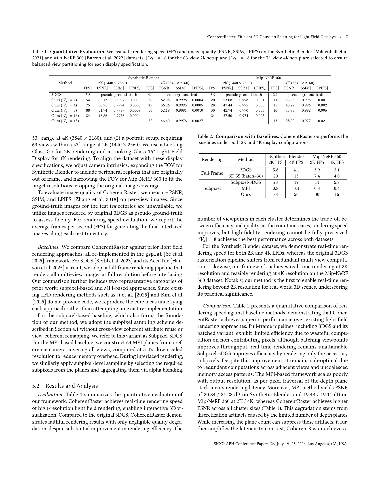

CoherentRaster: Efficient 3D Gaussian Splatting for Light Field Displays • 7
[[coherentraster-figures-tables.md#^table-001|Table 1]]. Quantitative Evaluation. We evaluate rendering speed (FPS) and image quality (PSNR, SSIM, LPIPS) on the Synthetic Blender [Mildenhall et al.
2021] and Mip-NeRF 360 [Barron et al. 2022] datasets. |V𝑘 | = 16 for the 63-view 2K setup and |V𝑘 | = 18 for the 71-view 4K setup are selected to ensure
balanced view partitioning for each display specification.

#### Method

Synthetic Blender Mip-NeRF 360
2K (1440 × 2560) 4K (3840 × 2160) 2K (1440 × 2560) 4K (3840 × 2160)
FPS↑ PSNR↑ SSIM↑ LPIPS↓ FPS↑ PSNR↑ SSIM↑ LPIPS↓ FPS↑ PSNR↑ SSIM↑ LPIPS↓ FPS↑ PSNR↑ SSIM↑ LPIPS↓
3DGS 5.8 pseudo ground-truth 4.1 pseudo ground-truth 3.9 pseudo ground-truth 2.1 pseudo ground-truth
Ours (|𝑉𝑘 | = 2) 54 62.13 0.9997 0.0003 36 62.08 0.9998 0.0004 20 53.08 0.998 0.001 11 53.35 0.998 0.001
Ours (|𝑉𝑘 | = 4) 75 56.75 0.9994 0.0005 49 56.86 0.9995 0.0005 28 47.44 0.995 0.003 15 48.27 0.996 0.002
Ours (|𝑉𝑘 | = 8) 88 51.94 0.9989 0.0009 56 52.19 0.9991 0.0010 30 42.74 0.990 0.008 16 43.78 0.992 0.006
Ours (|𝑉𝑘 | = 16) 84 46.86 0.9976 0.0024 - - - - 24 37.50 0.974 0.025 - - - -
Ours (|𝑉𝑘 | = 18) - - - - 52 46.40 0.9976 0.0027 - - - - 13 38.00 0.977 0.021
53◦ range at 4K (3840 × 2160), and (2) a portrait setup, requiring
63 views within a 53◦ range at 2K (1440 × 2560). We use a Looking
Glass Go for 2K rendering and a Looking Glass 16" Light Field
Display for 4K rendering. To align the dataset with these display
specifications, we adjust camera intrinsics: expanding the FOV for
Synthetic Blender to include peripheral regions that are originally
out of frame, and narrowing the FOV for Mip-NeRF 360 to fit the
target resolutions, cropping the original image coverage.
To evaluate image quality of CoherentRaster, we measure PSNR,
SSIM, and LPIPS [Zhang et al. 2018] on per-view images. Since
ground-truth images for the test trajectories are unavailable, we
utilize images rendered by original 3DGS as pseudo ground-truth
to assess fidelity. For rendering speed evaluation, we report the
average frames per second (FPS) for generating the final interlaced
images along each test trajectory.
Baselines. We compare CoherentRaster against prior light field
rendering approaches, all re-implemented in the gsplat [Ye et al.
2025] framework. For 3DGS [Kerbl et al. 2023] and its AccuTile [Han-
son et al. 2025] variant, we adopt a full-frame rendering pipeline that
renders all multi-view images at full resolution before interlacing.
Our comparison further includes two representative categories of
prior work: subpixel-based and MPI-based approaches. Since exist-
ing LFD rendering methods such as Ji et al. [2025] and Kim et al.
[2025] do not provide code, we reproduce the core ideas underlying
each approach rather than attempting an exact re-implementation.
For the subpixel-based baseline, which also forms the founda-
tion of our method, we adopt the subpixel sampling scheme de-
scribed in Section 4.1 without cross-view coherent attribute reuse or
view-coherent remapping. We refer to this variant as Subpixel-3DGS.
For the MPI-based baseline, we construct 64 MPI planes from a ref-
erence camera covering all views, computed at a 4× downscaled
resolution to reduce memory overhead. During interlaced rendering,
we similarly apply subpixel-level sampling by selecting the required
subpixels from the planes and aggregating them via alpha blending.

##### 5.2 Results and Analysis

Evaluation. [[coherentraster-figures-tables.md#^table-001|Table 1]] summarizes the quantitative evaluation of
our framework. CoherentRaster achieves real-time rendering speed
of high-resolution light field rendering, enabling interactive 3D vi-
sualization. Compared to the original 3DGS, CoherentRaster demon-
strates faithful rendering results with only negligible quality degra-
dation, despite substantial improvement in rendering efficiency. The
[[coherentraster-figures-tables.md#^table-002|Table 2]]. Comparison with Baselines. CoherentRaster outperforms the
baselines under both 2K and 4K display configurations.
Rendering Method
Synthetic Blender Mip-NeRF 360
2K FPS 4K FPS 2K FPS 4K FPS
Full-Frame
3DGS 5.8 4.1 3.9 2.1
3DGS (batch=36) 20 13 7.4 4.0
Subpixel
Subpixel-3DGS 28 19 11 5.7
MPI 0.8 0.4 0.8 0.4
Ours 88 56 30 16
number of viewpoints in each cluster determines the trade-off be-
tween efficiency and quality: as the count increases, rendering speed
improves, but high-fidelity rendering cannot be fully preserved.
|V𝑘 | = 8 achieves the best performance across both datasets.
For the Synthetic Blender dataset, we demonstrate real-time ren-
dering speed for both 2K and 4K LFDs, whereas the original 3DGS
rasterization pipeline suffers from redundant multi-view computa-
tion. Likewise, our framework achieves real-time rendering at 2K
resolution and feasible rendering at 4K resolution on the Mip-NeRF
360 dataset. Notably, our method is the first to enable real-time ren-
dering beyond 2K resolution for real-world 3D scenes, underscoring
its practical significance.
Comparison. [[coherentraster-figures-tables.md#^table-002|Table 2]] presents a quantitative comparison of ren-
dering speed against baseline methods, demonstrating that Coher-
entRaster achieves superior performance over existing light field
rendering approaches. Full-frame pipelines, including 3DGS and its
batched variant, exhibit limited efficiency due to wasteful compu-
tation on non-contributing pixels; although batching viewpoints
improves throughput, real-time rendering remains unattainable.
Subpixel-3DGS improves efficiency by rendering only the necessary
subpixels. Despite this improvement, it remains sub-optimal due
to redundant computations across adjacent views and uncoalesced
memory access patterns. The MPI-based framework scales poorly
with output resolution, as per-pixel traversal of the depth plane
stack incurs rendering latency. Moreover, MPI method yields PSNR
of 20.84 / 21.28 dB on Synthetic Blender and 19.48 / 19.11 dB on
Mip-NeRF 360 at 2K / 4K, whereas CoherentRaster achieves higher
PSNR across all cluster sizes ([[coherentraster-figures-tables.md#^table-001|Table 1]]). This degradation stems from
discretization artifacts caused by the limited number of depth planes.
While increasing the plane count can suppress these artifacts, it fur-
ther amplifies the latency. In contrast, CoherentRaster achieves a
SIGGRAPH Conference Papers ’26, July 19-23, 2026, Los Angeles, CA, USA.

### Page 8

<!-- page:8 chars:7647 image_objects:0 -->

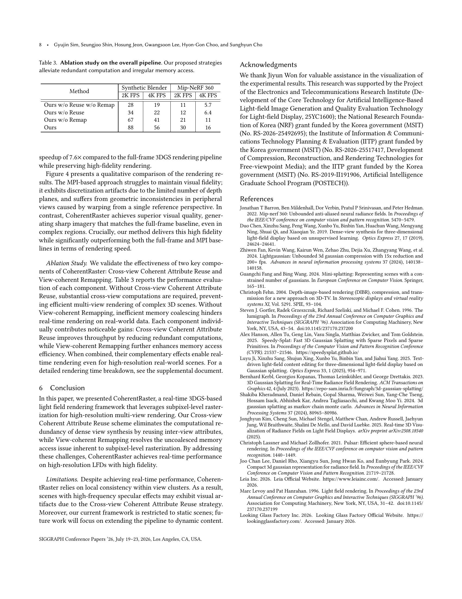

8 • Gyujin Sim, Seungjoo Shin, Hosung Jeon, Gwangsoon Lee, Hyon-Gon Choo, and Sunghyun Cho
[[coherentraster-figures-tables.md#^table-003|Table 3]]. Ablation study on the overall pipeline. Our proposed strategies
alleviate redundant computation and irregular memory access.

#### Method

Synthetic Blender Mip-NeRF 360
2K FPS 4K FPS 2K FPS 4K FPS
Ours w/o Reuse w/o Remap 28 19 11 5.7
Ours w/o Reuse 34 22 12 6.4
Ours w/o Remap 67 41 21 11
Ours 88 56 30 16
speedup of 7.6× compared to the full-frame 3DGS rendering pipeline
while preserving high-fidelity rendering.
[[coherentraster-figures-tables.md#^fig-004|Figure 4]] presents a qualitative comparison of the rendering re-
sults. The MPI-based approach struggles to maintain visual fidelity;
it exhibits discretization artifacts due to the limited number of depth
planes, and suffers from geometric inconsistencies in peripheral
views caused by warping from a single reference perspective. In
contrast, CoherentRaster achieves superior visual quality, gener-
ating sharp imagery that matches the full-frame baseline, even in
complex regions. Crucially, our method delivers this high fidelity
while significantly outperforming both the full-frame and MPI base-
lines in terms of rendering speed.
Ablation Study. We validate the effectiveness of two key compo-
nents of CoherentRaster: Cross-view Coherent Attribute Reuse and
View-coherent Remapping. [[coherentraster-figures-tables.md#^table-003|Table 3]] reports the performance evalua-
tion of each component. Without Cross-view Coherent Attribute
Reuse, substantial cross-view computations are required, prevent-
ing efficient multi-view rendering of complex 3D scenes. Without
View-coherent Remapping, inefficient memory coalescing hinders
real-time rendering on real-world data. Each component individ-
ually contributes noticeable gains: Cross-view Coherent Attribute
Reuse improves throughput by reducing redundant computations,
while View-coherent Remapping further enhances memory access
efficiency. When combined, their complementary effects enable real-
time rendering even for high-resolution real-world scenes. For a
detailed rendering time breakdown, see the supplemental document.

#### 6 Conclusion

In this paper, we presented CoherentRaster, a real-time 3DGS-based
light field rendering framework that leverages subpixel-level raster-
ization for high-resolution multi-view rendering. Our Cross-view
Coherent Attribute Reuse scheme eliminates the computational re-
dundancy of dense view synthesis by reusing inter-view attributes,
while View-coherent Remapping resolves the uncoalesced memory
access issue inherent to subpixel-level rasterization. By addressing
these challenges, CoherentRaster achieves real-time performance
on high-resolution LFDs with high fidelity.
Limitations. Despite achieving real-time performance, Coheren-
tRaster relies on local consistency within view clusters. As a result,
scenes with high-frequency specular effects may exhibit visual ar-
tifacts due to the Cross-view Coherent Attribute Reuse strategy.
Moreover, our current framework is restricted to static scenes; fu-
ture work will focus on extending the pipeline to dynamic content.
Acknowledgments
We thank Jiyun Won for valuable assistance in the visualization of
the experimental results. This research was supported by the Project
of the Electronics and Telecommunications Research Institute (De-
velopment of the Core Technology for Artificial Intelligence-Based
Light-field Image Generation and Quality Evaluation Technology
for Light-field Display, 25YC1600); the National Research Founda-
tion of Korea (NRF) grant funded by the Korea government (MSIT)
(No. RS-2026-25492695); the Institute of Information & Communi-
cations Technology Planning & Evaluation (IITP) grant funded by
the Korea government (MSIT) (No. RS-2026-25517417, Development
of Compression, Reconstruction, and Rendering Technologies for
Free-viewpoint Media); and the IITP grant funded by the Korea
government (MSIT) (No. RS-2019-II191906, Artificial Intelligence
Graduate School Program (POSTECH)).

#### References

Jonathan T Barron, Ben Mildenhall, Dor Verbin, Pratul P Srinivasan, and Peter Hedman.
2022. Mip-nerf 360: Unbounded anti-aliased neural radiance fields. In Proceedings of
the IEEE/CVF conference on computer vision and pattern recognition. 5470-5479.
Duo Chen, Xinzhu Sang, Peng Wang, Xunbo Yu, Binbin Yan, Huachun Wang, Mengyang
Ning, Shuai Qi, and Xiaoqian Ye. 2019. Dense-view synthesis for three-dimensional
light-field display based on unsupervised learning. Optics Express 27, 17 (2019),
24624-24641.
Zhiwen Fan, Kevin Wang, Kairun Wen, Zehao Zhu, Dejia Xu, Zhangyang Wang, et al.

#### 2024. Lightgaussian: Unbounded 3d gaussian compression with 15x reduction and

200+ fps. Advances in neural information processing systems 37 (2024), 140138-
140158.
Guangchi Fang and Bing Wang. 2024. Mini-splatting: Representing scenes with a con-
strained number of gaussians. In European Conference on Computer Vision. Springer,
165-181.
Christoph Fehn. 2004. Depth-image-based rendering (DIBR), compression, and trans-
mission for a new approach on 3D-TV. In Stereoscopic displays and virtual reality
systems XI, Vol. 5291. SPIE, 93-104.
Steven J. Gortler, Radek Grzeszczuk, Richard Szeliski, and Michael F. Cohen. 1996. The
lumigraph. In Proceedings of the 23rd Annual Conference on Computer Graphics and
Interactive Techniques (SIGGRAPH ’96). Association for Computing Machinery, New
York, NY, USA, 43-54. doi:10.1145/237170.237200
Alex Hanson, Allen Tu, Geng Lin, Vasu Singla, Matthias Zwicker, and Tom Goldstein.

#### 2025. Speedy-Splat: Fast 3D Gaussian Splatting with Sparse Pixels and Sparse

Primitives. In Proceedings of the Computer Vision and Pattern Recognition Conference
(CVPR). 21537-21546. https://speedysplat.github.io/
Luyu Ji, Xinzhu Sang, Shujun Xing, Xunbo Yu, Binbin Yan, and Jiahui Yang. 2025. Text-
driven light-field content editing for three-dimensional light-field display based on
Gaussian splatting. Optics Express 33, 1 (2025), 954-971.
Bernhard Kerbl, Georgios Kopanas, Thomas Leimkühler, and George Drettakis. 2023.
3D Gaussian Splatting for Real-Time Radiance Field Rendering. ACM Transactions on
Graphics 42, 4 (July 2023). https://repo-sam.inria.fr/fungraph/3d-gaussian-splatting/
Shakiba Kheradmand, Daniel Rebain, Gopal Sharma, Weiwei Sun, Yang-Che Tseng,
Hossam Isack, Abhishek Kar, Andrea Tagliasacchi, and Kwang Moo Yi. 2024. 3d
gaussian splatting as markov chain monte carlo. Advances in Neural Information
Processing Systems 37 (2024), 80965-80986.
Jonghyun Kim, Cheng Sun, Michael Stengel, Matthew Chan, Andrew Russell, Jaehyun
Jung, Wil Braithwaite, Shalini De Mello, and David Luebke. 2025. Real-time 3D Visu-
alization of Radiance Fields on Light Field Displays. arXiv preprint arXiv:2508.18540
(2025).
Christoph Lassner and Michael Zollhofer. 2021. Pulsar: Efficient sphere-based neural
rendering. In Proceedings of the IEEE/CVF conference on computer vision and pattern
recognition. 1440-1449.
Joo Chan Lee, Daniel Rho, Xiangyu Sun, Jong Hwan Ko, and Eunbyung Park. 2024.
Compact 3d gaussian representation for radiance field. In Proceedings of the IEEE/CVF
Conference on Computer Vision and Pattern Recognition. 21719-21728.
Leia Inc. 2026. Leia Official Website. https://www.leiainc.com/. Accessed: January
2026.
Marc Levoy and Pat Hanrahan. 1996. Light field rendering. In Proceedings of the 23rd
Annual Conference on Computer Graphics and Interactive Techniques (SIGGRAPH ’96).
Association for Computing Machinery, New York, NY, USA, 31-42. doi:10.1145/
237170.237199
Looking Glass Factory Inc. 2026. Looking Glass Factory Official Website. https://
lookingglassfactory.com/. Accessed: January 2026.
SIGGRAPH Conference Papers ’26, July 19-23, 2026, Los Angeles, CA, USA.

### Page 9

<!-- page:9 chars:2651 image_objects:0 -->

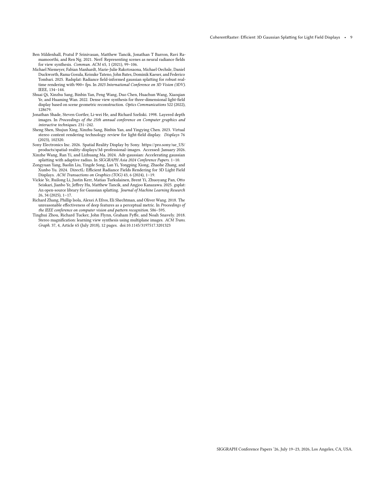

CoherentRaster: Efficient 3D Gaussian Splatting for Light Field Displays • 9
Ben Mildenhall, Pratul P Srinivasan, Matthew Tancik, Jonathan T Barron, Ravi Ra-
mamoorthi, and Ren Ng. 2021. Nerf: Representing scenes as neural radiance fields
for view synthesis. Commun. ACM 65, 1 (2021), 99-106.
Michael Niemeyer, Fabian Manhardt, Marie-Julie Rakotosaona, Michael Oechsle, Daniel
Duckworth, Rama Gosula, Keisuke Tateno, John Bates, Dominik Kaeser, and Federico
Tombari. 2025. Radsplat: Radiance field-informed gaussian splatting for robust real-
time rendering with 900+ fps. In 2025 International Conference on 3D Vision (3DV).
IEEE, 134-144.
Shuai Qi, Xinzhu Sang, Binbin Yan, Peng Wang, Duo Chen, Huachun Wang, Xiaoqian
Ye, and Huaming Wan. 2022. Dense view synthesis for three-dimensional light-field
display based on scene geometric reconstruction. Optics Communications 522 (2022),
128679.
Jonathan Shade, Steven Gortler, Li-wei He, and Richard Szeliski. 1998. Layered depth
images. In Proceedings of the 25th annual conference on Computer graphics and
interactive techniques. 231-242.
Sheng Shen, Shujun Xing, Xinzhu Sang, Binbin Yan, and Yingying Chen. 2023. Virtual
stereo content rendering technology review for light-field display. Displays 76
(2023), 102320.
Sony Electronics Inc. 2026. Spatial Reality Display by Sony. https://pro.sony/ue_US/
products/spatial-reality-displays/3d-professional-images. Accessed: January 2026.
Xinzhe Wang, Ran Yi, and Lizhuang Ma. 2024. Adr-gaussian: Accelerating gaussian
splatting with adaptive radius. In SIGGRAPH Asia 2024 Conference Papers. 1-10.
Zongyuan Yang, Baolin Liu, Yingde Song, Lan Yi, Yongping Xiong, Zhaohe Zhang, and
Xunbo Yu. 2024. DirectL: Efficient Radiance Fields Rendering for 3D Light Field
Displays. ACM Transactions on Graphics (TOG) 43, 6 (2024), 1-19.
Vickie Ye, Ruilong Li, Justin Kerr, Matias Turkulainen, Brent Yi, Zhuoyang Pan, Otto
Seiskari, Jianbo Ye, Jeffrey Hu, Matthew Tancik, and Angjoo Kanazawa. 2025. gsplat:
An open-source library for Gaussian splatting. Journal of Machine Learning Research
26, 34 (2025), 1-17.
Richard Zhang, Phillip Isola, Alexei A Efros, Eli Shechtman, and Oliver Wang. 2018. The
unreasonable effectiveness of deep features as a perceptual metric. In Proceedings of
the IEEE conference on computer vision and pattern recognition. 586-595.
Tinghui Zhou, Richard Tucker, John Flynn, Graham Fyffe, and Noah Snavely. 2018.
Stereo magnification: learning view synthesis using multiplane images. ACM Trans.
Graph. 37, 4, Article 65 (July 2018), 12 pages. doi:10.1145/3197517.3201323
SIGGRAPH Conference Papers ’26, July 19-23, 2026, Los Angeles, CA, USA.

### Page 10

<!-- page:10 chars:894 image_objects:48 -->

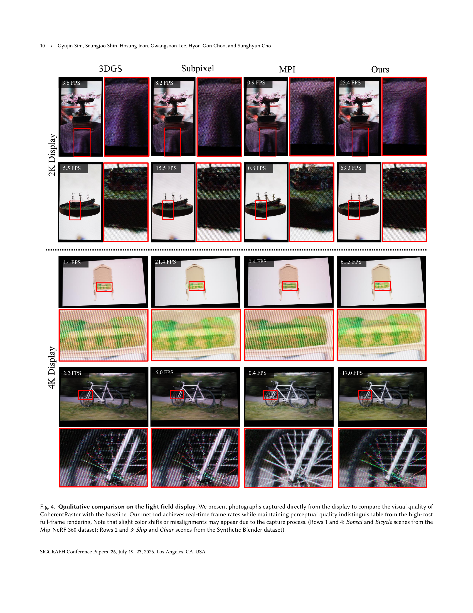

10 • Gyujin Sim, Seungjoo Shin, Hosung Jeon, Gwangsoon Lee, Hyon-Gon Choo, and Sunghyun Cho
Subpixel MPI Ours
3DGS

##### 4.4 FPS

3.6 FPS 8.2 FPS 0.9 FPS 25.4 FPS
5.5 FPS 15.5 FPS 0.8 FPS 63.3 FPS
21.4 FPS 0.4 FPS 61.5 FPS
2.2 FPS 6.0 FPS 0.4 FPS 17.0 FPS
2K
Display
4K
Display
[[coherentraster-figures-tables.md#^fig-004|Fig. 4]]. Qualitative comparison on the light field display. We present photographs captured directly from the display to compare the visual quality of
CoherentRaster with the baseline. Our method achieves real-time frame rates while maintaining perceptual quality indistinguishable from the high-cost
full-frame rendering. Note that slight color shifts or misalignments may appear due to the capture process. (Rows 1 and 4: Bonsai and Bicycle scenes from the
Mip-NeRF 360 dataset; Rows 2 and 3: Ship and Chair scenes from the Synthetic Blender dataset)
SIGGRAPH Conference Papers ’26, July 19-23, 2026, Los Angeles, CA, USA.

### Page 11

<!-- page:11 chars:533 image_objects:44 -->

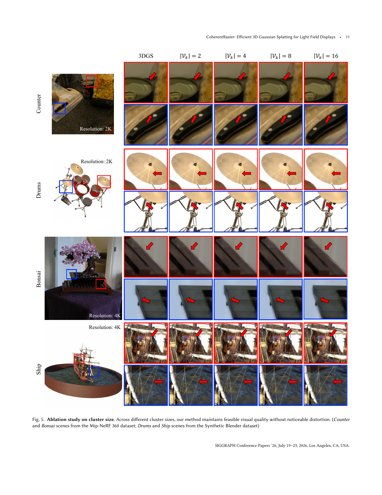

CoherentRaster: Efficient 3D Gaussian Splatting for Light Field Displays • 11
Counter
3DGS !! = 2 !! = 4 !! = 8 !! = 16
Drums
Bonsai
Ship
Resolution: 4K
Resolution: 4K
Resolution: 2K
Resolution: 2K
[[coherentraster-figures-tables.md#^fig-005|Fig. 5]]. Ablation study on cluster size. Across different cluster sizes, our method maintains feasible visual quality without noticeable distortion. (Counter
and Bonsai scenes from the Mip-NeRF 360 dataset; Drums and Ship scenes from the Synthetic Blender dataset)
SIGGRAPH Conference Papers ’26, July 19-23, 2026, Los Angeles, CA, USA.

### Page 12

<!-- page:12 chars:4452 image_objects:0 -->

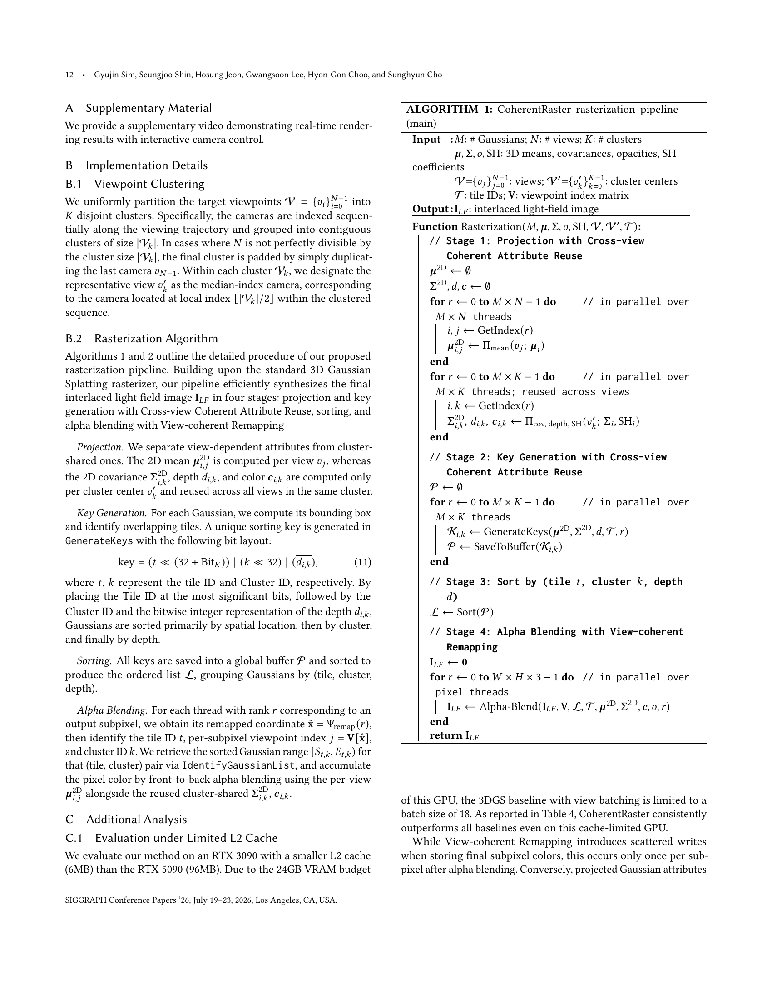

12 • Gyujin Sim, Seungjoo Shin, Hosung Jeon, Gwangsoon Lee, Hyon-Gon Choo, and Sunghyun Cho
A Supplementary Material
We provide a supplementary video demonstrating real-time render-
ing results with interactive camera control.
B Implementation Details
B.1 Viewpoint Clustering
We uniformly partition the target viewpoints V = {𝑣𝑖 }𝑁 −1
𝑖=0 into
𝐾 disjoint clusters. Specifically, the cameras are indexed sequen-
tially along the viewing trajectory and grouped into contiguous
clusters of size |V𝑘 |. In cases where 𝑁 is not perfectly divisible by
the cluster size |V𝑘 |, the final cluster is padded by simply duplicat-
ing the last camera 𝑣𝑁 −1. Within each cluster V𝑘 , we designate the
representative view 𝑣′
𝑘
as the median-index camera, corresponding
to the camera located at local index ⌊|V𝑘 |/2⌋ within the clustered
sequence.
B.2 Rasterization Algorithm
Algorithms 1 and 2 outline the detailed procedure of our proposed
rasterization pipeline. Building upon the standard 3D Gaussian
Splatting rasterizer, our pipeline efficiently synthesizes the final
interlaced light field image I𝐿𝐹 in four stages: projection and key
generation with Cross-view Coherent Attribute Reuse, sorting, and
alpha blending with View-coherent Remapping
Projection. We separate view-dependent attributes from cluster-
shared ones. The 2D mean 𝝁2D
𝑖,𝑗 is computed per view 𝑣𝑗 , whereas
the 2D covariance 𝚺2D
𝑖,𝑘 , depth 𝑑𝑖,𝑘 , and color 𝒄𝑖,𝑘 are computed only
per cluster center 𝑣′
𝑘
and reused across all views in the same cluster.
Key Generation. For each Gaussian, we compute its bounding box
and identify overlapping tiles. A unique sorting key is generated in
GenerateKeys with the following bit layout:
key = (𝑡 ≪ (32 + Bit𝐾 )) | (𝑘 ≪ 32) | (𝑑𝑖,𝑘 ), (11)
where 𝑡, 𝑘 represent the tile ID and Cluster ID, respectively. By
placing the Tile ID at the most significant bits, followed by the
Cluster ID and the bitwise integer representation of the depth 𝑑𝑖,𝑘 ,
Gaussians are sorted primarily by spatial location, then by cluster,
and finally by depth.
Sorting. All keys are saved into a global buffer P and sorted to
produce the ordered list L, grouping Gaussians by (tile, cluster,
depth).
Alpha Blending. For each thread with rank 𝑟 corresponding to an
output subpixel, we obtain its remapped coordinate x̂ = Ψremap(𝑟),
then identify the tile ID 𝑡, per-subpixel viewpoint index 𝑗 = V[x̂],
and cluster ID𝑘. We retrieve the sorted Gaussian range [𝑆𝑡,𝑘, 𝐸𝑡,𝑘 ) for
that (tile, cluster) pair via IdentifyGaussianList, and accumulate
the pixel color by front-to-back alpha blending using the per-view
𝝁2D
𝑖,𝑗 alongside the reused cluster-shared 𝚺2D
𝑖,𝑘 , 𝒄𝑖,𝑘 .
C Additional Analysis
C.1 Evaluation under Limited L2 Cache
We evaluate our method on an RTX 3090 with a smaller L2 cache
(6MB) than the RTX 5090 (96MB). Due to the 24GB VRAM budget
ALGORITHM 1: CoherentRaster rasterization pipeline
(main)
Input :𝑀: # Gaussians; 𝑁: # views; 𝐾: # clusters
𝝁, 𝚺,𝑜, SH: 3D means, covariances, opacities, SH
coefficients
V={𝑣𝑗 }𝑁 −1
𝑗=0 : views; V′={𝑣′
𝑘
}𝐾−1
𝑘=0
: cluster centers
T: tile IDs; V: viewpoint index matrix
Output:I𝐿𝐹 : interlaced light-field image
Function Rasterization(𝑀, 𝝁, 𝚺,𝑜, SH, V, V′, T):
// Stage 1: Projection with Cross-view
Coherent Attribute Reuse
𝝁2D ← ∅
𝚺2D
,𝑑, 𝒄 ← ∅
for 𝑟 ← 0 to 𝑀 × 𝑁 − 1 do // in parallel over
𝑀 × 𝑁 threads
𝑖, 𝑗 ← GetIndex(𝑟)
𝝁2D
𝑖,𝑗 ← Πmean(𝑣𝑗 ; 𝝁𝑖)
end
for 𝑟 ← 0 to 𝑀 × 𝐾 − 1 do // in parallel over
𝑀 × 𝐾 threads; reused across views
𝑖,𝑘 ← GetIndex(𝑟)
𝚺2D
𝑖,𝑘 , 𝑑𝑖,𝑘, 𝒄𝑖,𝑘 ← Πcov, depth, SH(𝑣′
𝑘
; 𝚺𝑖, SH𝑖)
end
// Stage 2: Key Generation with Cross-view
Coherent Attribute Reuse
P ← ∅
for 𝑟 ← 0 to 𝑀 × 𝐾 − 1 do // in parallel over
𝑀 × 𝐾 threads
K𝑖,𝑘 ← GenerateKeys(𝝁2D, 𝚺2D
,𝑑, T,𝑟)
P ← SaveToBuffer(K𝑖,𝑘 )
end
// Stage 3: Sort by (tile 𝑡, cluster 𝑘, depth
𝑑)
L ← Sort(P)
// Stage 4: Alpha Blending with View-coherent
Remapping
I𝐿𝐹 ← 0
for 𝑟 ← 0 to 𝑊 × 𝐻 × 3 − 1 do // in parallel over
pixel threads
I𝐿𝐹 ← Alpha-Blend(I𝐿𝐹 , V, L, T, 𝝁2D, 𝚺2D
, 𝒄,𝑜,𝑟)
end
return I𝐿𝐹
of this GPU, the 3DGS baseline with view batching is limited to a
batch size of 18. As reported in [[coherentraster-figures-tables.md#^table-004|Table 4]], CoherentRaster consistently
outperforms all baselines even on this cache-limited GPU.
While View-coherent Remapping introduces scattered writes
when storing final subpixel colors, this occurs only once per sub-
pixel after alpha blending. Conversely, projected Gaussian attributes
SIGGRAPH Conference Papers ’26, July 19-23, 2026, Los Angeles, CA, USA.

### Page 13

<!-- page:13 chars:3254 image_objects:4 -->

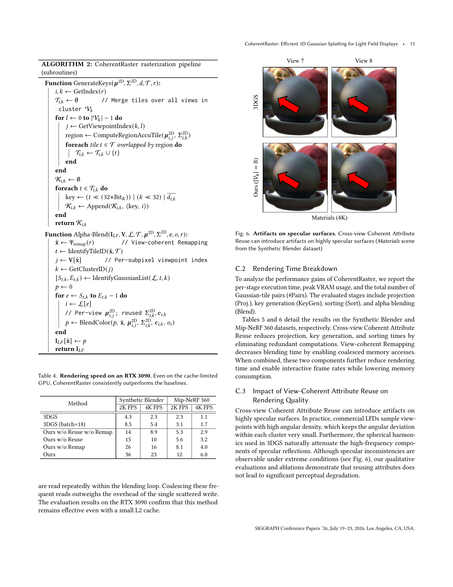

CoherentRaster: Efficient 3D Gaussian Splatting for Light Field Displays • 13
ALGORITHM 2: CoherentRaster rasterization pipeline
(subroutines)
Function GenerateKeys(𝝁2D, 𝚺2D
,𝑑, T,𝑟):
𝑖,𝑘 ← GetIndex(𝑟)
T
𝑖,𝑘 ← ∅ // Merge tiles over all views in
cluster V𝑘
for 𝑙 ← 0 to |V𝑘 | − 1 do
𝑗 ← GetViewpointIndex(𝑘,𝑙)
region ← ComputeRegionAccuTile(𝝁2D
𝑖,𝑗 , 𝚺2D
𝑖,𝑘 )
foreach tile 𝑡 ∈ T overlapped by region do
T
𝑖,𝑘 ← T
𝑖,𝑘 ∪ {𝑡}
end
end
K𝑖,𝑘 ← ∅
foreach 𝑡 ∈ T
𝑖,𝑘 do
key ← (𝑡 ≪ (32+Bit𝐾 )) | (𝑘 ≪ 32) | 𝑑𝑖,𝑘
K𝑖,𝑘 ← Append(K𝑖,𝑘, ⟨key, 𝑖⟩)
end
return K𝑖,𝑘
Function Alpha-Blend(I𝐿𝐹 , V, L, T, 𝝁2D, 𝚺2D
, 𝒄,𝑜,𝑟):
x̂ ← Ψremap(𝑟) // View-coherent Remapping
𝑡 ← IdentifyTileID(x̂, T)
𝑗 ← V[x̂] // Per-subpixel viewpoint index
𝑘 ← GetClusterID(𝑗)
[𝑆𝑡,𝑘, 𝐸𝑡,𝑘 ) ← IdentifyGaussianList(L,𝑡,𝑘)
𝑝 ← 0
for 𝑒 ← 𝑆𝑡,𝑘 to 𝐸𝑡,𝑘 − 1 do
𝑖 ← L[𝑒]
// Per-view 𝝁2D
𝑖,𝑗 ; reused 𝚺2D
𝑖,𝑘 , 𝒄𝑖,𝑘
𝑝 ← BlendColor(𝑝, x̂, 𝝁2D
𝑖,𝑗 , 𝚺2D
𝑖,𝑘 , 𝒄𝑖,𝑘, 𝑜𝑖)
end
I𝐿𝐹 [x̂] ← 𝑝
return I𝐿𝐹
[[coherentraster-figures-tables.md#^table-004|Table 4]]. Rendering speed on an RTX 3090. Even on the cache-limited
GPU, CoherentRaster consistently outperforms the baselines.

#### Method

Synthetic Blender Mip-NeRF 360
2K FPS 4K FPS 2K FPS 4K FPS
3DGS 4.3 2.3 2.3 1.1
3DGS (batch=18) 8.5 5.4 3.1 1.7
Ours w/o Reuse w/o Remap 14 8.9 5.3 2.9
Ours w/o Reuse 15 10 5.6 3.2
Ours w/o Remap 26 16 8.1 4.0
Ours 36 23 12 6.0
are read repeatedly within the blending loop. Coalescing these fre-
quent reads outweighs the overhead of the single scattered write.
The evaluation results on the RTX 3090 confirm that this method
remains effective even with a small L2 cache.
3DGS
Ours
(
𝒱
8)
View 7 View 8
Materials (4K)
[[coherentraster-figures-tables.md#^fig-006|Fig. 6]]. Artifacts on specular surfaces. Cross-view Coherent Attribute
Reuse can introduce artifacts on highly specular surfaces (Materials scene
from the Synthetic Blender dataset)
C.2 Rendering Time Breakdown
To analyze the performance gains of CoherentRaster, we report the
per-stage execution time, peak VRAM usage, and the total number of
Gaussian-tile pairs (#Pairs). The evaluated stages include projection
(Proj.), key generation (KeyGen), sorting (Sort), and alpha blending
(Blend).
Tables 5 and 6 detail the results on the Synthetic Blender and
Mip-NeRF 360 datasets, respectively. Cross-view Coherent Attribute
Reuse reduces projection, key generation, and sorting times by
eliminating redundant computations. View-coherent Remapping
decreases blending time by enabling coalesced memory accesses.
When combined, these two components further reduce rendering
time and enable interactive frame rates while lowering memory
consumption.
C.3 Impact of View-Coherent Attribute Reuse on
Rendering Quality
Cross-view Coherent Attribute Reuse can introduce artifacts on
highly specular surfaces. In practice, commercial LFDs sample view-
points with high angular density, which keeps the angular deviation
within each cluster very small. Furthermore, the spherical harmon-
ics used in 3DGS naturally attenuate the high-frequency compo-
nents of specular reflections. Although specular inconsistencies are
observable under extreme conditions (see [[coherentraster-figures-tables.md#^fig-006|Fig. 6]]), our qualitative
evaluations and ablations demonstrate that reusing attributes does
not lead to significant perceptual degradation.
SIGGRAPH Conference Papers ’26, July 19-23, 2026, Los Angeles, CA, USA.

### Page 14

<!-- page:14 chars:1302 image_objects:0 -->

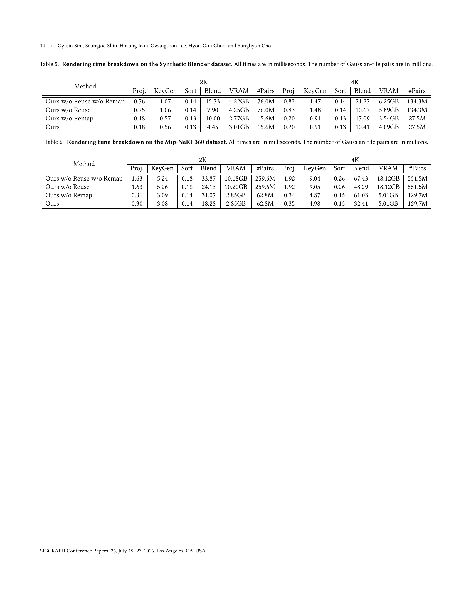

14 • Gyujin Sim, Seungjoo Shin, Hosung Jeon, Gwangsoon Lee, Hyon-Gon Choo, and Sunghyun Cho
[[coherentraster-figures-tables.md#^table-005|Table 5]]. Rendering time breakdown on the Synthetic Blender dataset. All times are in milliseconds. The number of Gaussian-tile pairs are in millions.

#### Method

2K 4K
Proj. KeyGen Sort Blend VRAM #Pairs Proj. KeyGen Sort Blend VRAM #Pairs
Ours w/o Reuse w/o Remap 0.76 1.07 0.14 15.73 4.22GB 76.0M 0.83 1.47 0.14 21.27 6.25GB 134.3M
Ours w/o Reuse 0.75 1.06 0.14 7.90 4.25GB 76.0M 0.83 1.48 0.14 10.67 5.89GB 134.3M
Ours w/o Remap 0.18 0.57 0.13 10.00 2.77GB 15.6M 0.20 0.91 0.13 17.09 3.54GB 27.5M
Ours 0.18 0.56 0.13 4.45 3.01GB 15.6M 0.20 0.91 0.13 10.41 4.09GB 27.5M
[[coherentraster-figures-tables.md#^table-006|Table 6]]. Rendering time breakdown on the Mip-NeRF 360 dataset. All times are in milliseconds. The number of Gaussian-tile pairs are in millions.

#### Method

2K 4K
Proj. KeyGen Sort Blend VRAM #Pairs Proj. KeyGen Sort Blend VRAM #Pairs
Ours w/o Reuse w/o Remap 1.63 5.24 0.18 33.87 10.18GB 259.6M 1.92 9.04 0.26 67.43 18.12GB 551.5M
Ours w/o Reuse 1.63 5.26 0.18 24.13 10.20GB 259.6M 1.92 9.05 0.26 48.29 18.12GB 551.5M
Ours w/o Remap 0.31 3.09 0.14 31.07 2.85GB 62.8M 0.34 4.87 0.15 61.03 5.01GB 129.7M
Ours 0.30 3.08 0.14 18.28 2.85GB 62.8M 0.35 4.98 0.15 32.41 5.01GB 129.7M
SIGGRAPH Conference Papers ’26, July 19-23, 2026, Los Angeles, CA, USA.
